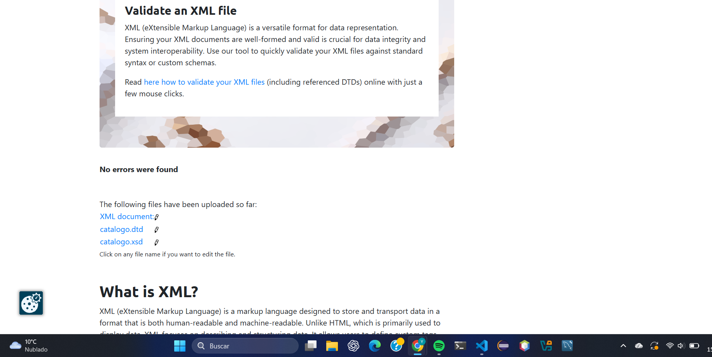
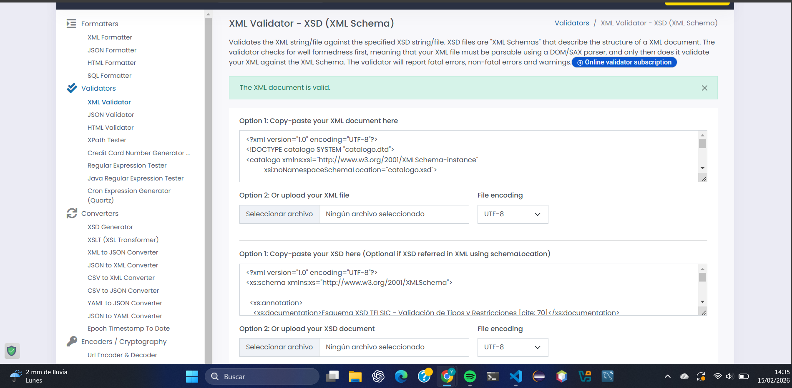

# Validación del archivo catalogo.xml 

## 1. Herramientas utilizadas 

### Validación DTD
- **Herramienta:** XMLValidation.com 
- **Versión:** Online 

### Validación XSD 
- **Herramienta:** FreeFormatter XML Validator 
- **Versión:** Online 

## 2. Proceso de validación

### Validación contra DTD 
**Comando/Pasos ejecutados:** 
1. Se cargó el archivo XML que incluye la declaración de tipo de documento externa.
2. Se proporcionó el archivo DTD externo para verificar la jerarquía y cardinalidad de todos los elementos declarados.
3. La herramienta confirmó que el documento es válido y está bien formado.

 

## 3. Proceso de validación 

### Validación contra XSD 
**Comando/Pasos ejecutados:** 
1. Se utilizó el esquema externo completo para validar los tipos de datos específicos.
2. Se verificó el cumplimiento de las restricciones aplicadas de patrones, rangos y enumeraciones.

 

## 4. Decisiones de diseño 

### ¿Por qué usar elementos vs atributos?
- **Elementos:** Se han utilizado para el contenido extenso, estructuras complejas y valores que pueden ser múltiples, como nombres, descripciones y materiales.
- **Atributos:** Se han empleado para identificadores únicos, metadatos simples y opciones de listas cerradas, como el ID y la categoría.

### Restricciones XSD aplicadas
1. **Restricción 1 (xs:pattern):** Justificada para obligar a que el identificador siga un formato estricto de una letra y tres números.
2. **Restricción 2 (xs:minInclusive):** Justificada para asegurar que los precios sean valores positivos coherentes y realistas.
3. **Restricción 3 (xs:enumeration):** Justificada para limitar las categorías a valores permitidos específicos.
4. **Restricción 4 (xs:fractionDigits):** Justificada para garantizar que los precios mantengan exactamente dos decimales.

## 5. Conclusiones 
Durante el desarrollo se utilizó Visual Studio Code con la extensión XML Tools para la edición del código. Durante la marcha, se ajustó el DTD para eliminar elementos no utilizados y sincronizar la cardinalidad con el contenido final del XML para asegurar una validación exitosa sin errores.